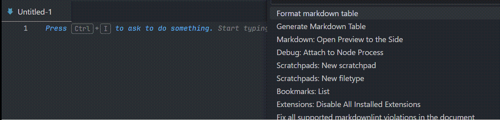

# Markdown table assistant

Generate markdown table.

Format markdown table.

## Features

## Commands

- **`format_table`**
  - Select and only select table code first.
- **`generate_table`**
  - Optional: You can type the number of rows/columns and alignment.

> TIP: Press Ctrl+Shift+P to type commands.

**Enjoy!**
